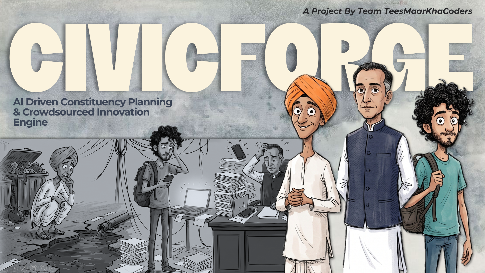
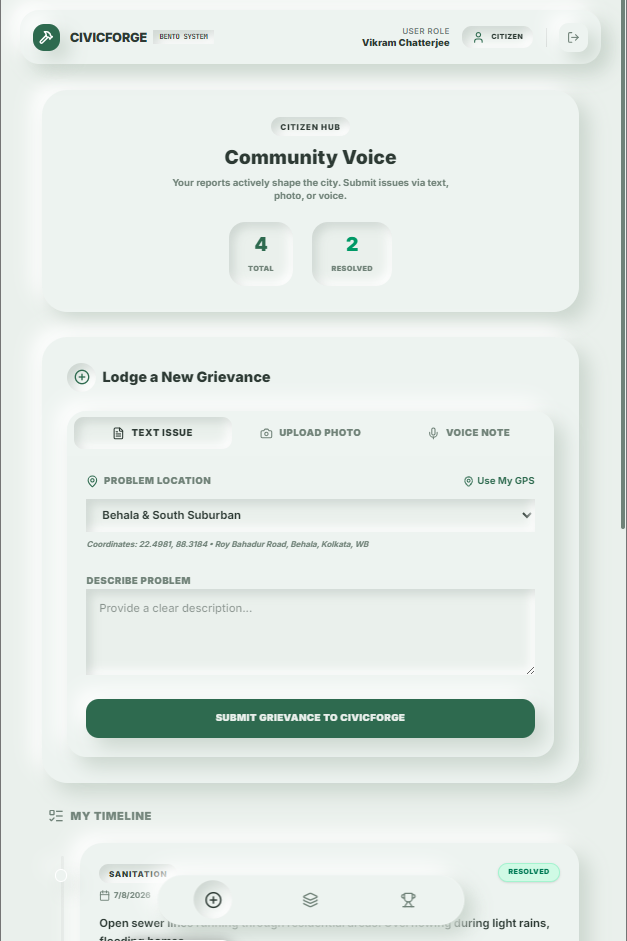
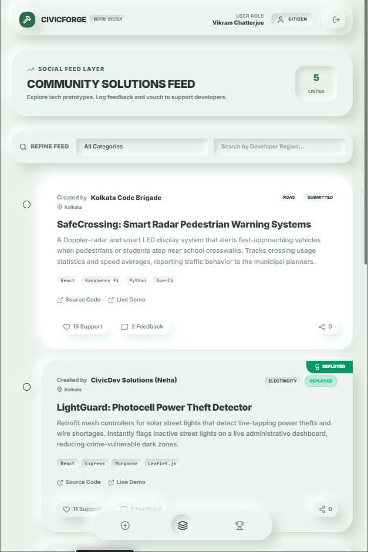
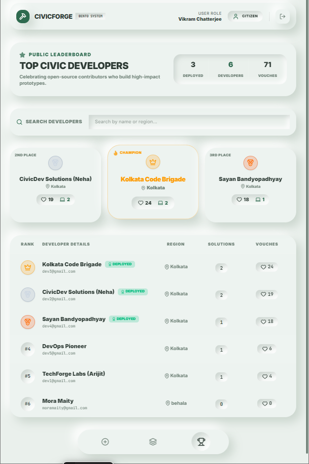
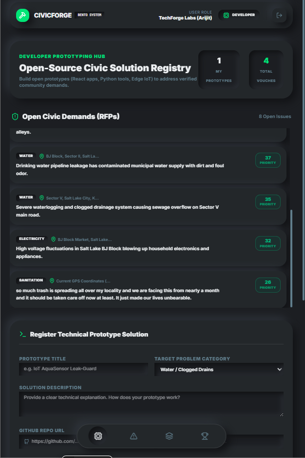
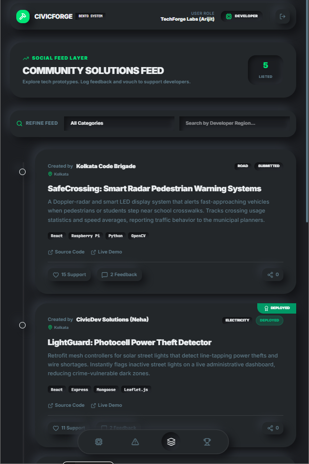
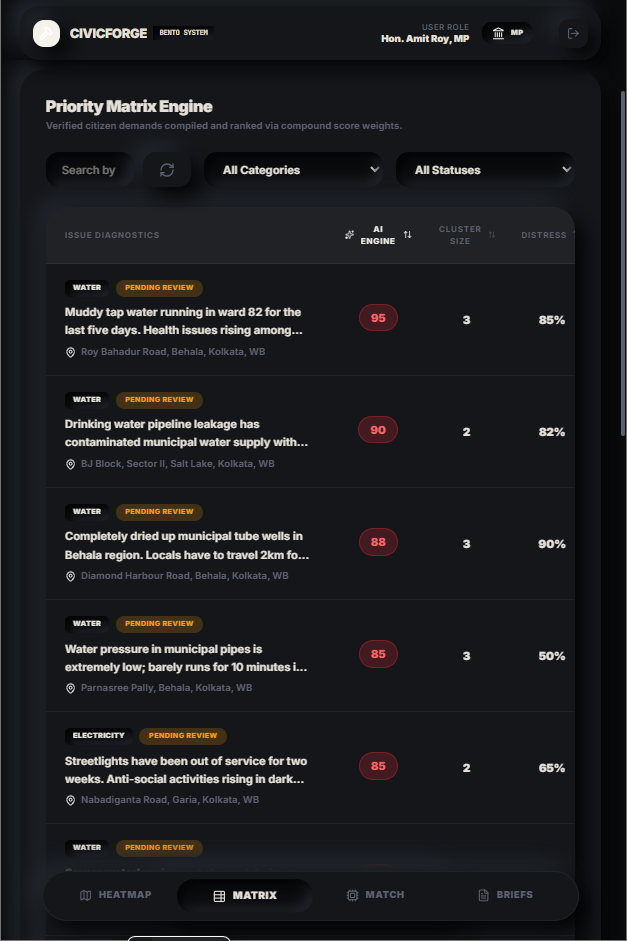
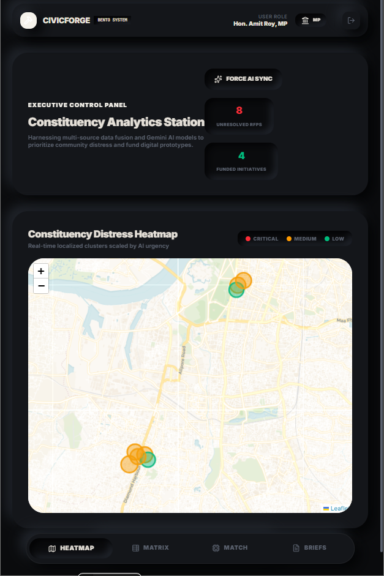
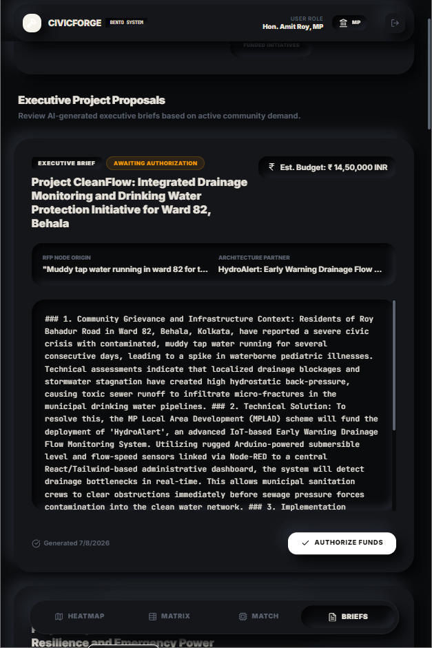

<p align="center">
  
</p>

> **Forging Data-Driven Constituency Progress.**
> *A dual-engine civic-tech ecosystem that replaces manual administrative guesswork with empirical data analytics and rapid crowdsourced execution.*

## 📖 Overview

CivicForge bridges the operational gap between parliamentary planning and real-time public demands by linking citizens, civic engineers, and representatives on a unified digital canvas. By converting unstructured public distress signals into quantified geographic demands, the system automatically pairs localized infrastructure deficits with ready-to-deploy open-source solutions.

---

## 🖼️ Visual Interface & Tri-Theme Architecture

### Citizen Hub (Light Mint Green Theme)
Empowering citizens to report issues with a frictionless, social-media-style vertical timeline.
<p align="center">
  
  
  
</p>

### Civic Engineer Marketplace (Dark Charcoal Theme)
A high-contrast, code-centric workspace for technical users to find civic RFPs and submit technical prototypes.
<p align="center">
  
  
</p>

### Executive Evaluation Station (Dark Noir Theme)
A premium dashboard for Members of Parliament featuring AI-prioritized matrices, live heatmaps, and automated funding proposals.
<p align="center">
  
  
  
</p>

---

## ✨ Core Architecture & Features

The platform operates on a three-layer system designed for transparency, speed, and accountability:

### 1. Citizen Ingestion Layer (The Input)
* **Omnichannel Submissions:** Residents lodge geotagged infrastructure complaints using text, photos, or raw voice notes.
* **AI Processing:** Google Gemini transcribes & translates multilingual voice notes, extracts category tags, scores emotional distress, and generates a semantic embedding of every complaint.
* **Spoken Confirmation:** ElevenLabs reads back a confirmation aloud, for accessibility when a citizen can't easily read a screen.
* **High-Precision Geotagging:** Locks exact coordinates for every grievance.

### 2. MP Priority Matrix (The Triage)
* **Dual Clustering (Geo + Semantic):** MongoDB Atlas `2dsphere` geospatial queries group reports by location, while **Atlas Vector Search** groups them by *meaning*, merging duplicate complaints about the same problem even when worded completely differently, so recurring issues stack urgency. Reports are fused with local census datasets to compute infrastructure gap scores.
* **Distress Heatmap:** Algorithmically ranks and visualizes infrastructure issues into a live, urgency-scaled spatial heatmap for Members of Parliament.
* **AI Audio Briefing:** One click has ElevenLabs read the top-priority grievances aloud, a hands-free executive briefing.

### 3. Civic Engineer Marketplace (The Execution)
* **Solution Registry:** Local civic engineering talent registers functional, open-source prototypes (software apps or IoT hardware) tagged to specific municipal categories.
* **Automated Matchmaking:** An intelligent recommendation layer directly couples verified regional structural deficits with community-built solutions.
* **One-Click Funding Blueprints:** Once an MP authorizes a problem-solution match, Gemini instantly auto-generates a structured, data-backed development funding proposal for immediate administrative execution.

---

## 🛠️ Technology Stack

**Frontend**
* React 19 & Vite 6
* Tailwind CSS v4 (Custom Neumorphic Tri-Theme Engine)
* Leaflet.js + MarkerCluster (Interactive Geospatial Heatmap)
* Framer Motion · Lucide React

**Backend & Database**
* Node.js & Express.js (single process that serves the SPA **and** the API)
* **MongoDB Atlas**: `2dsphere` geospatial indexing **and** Atlas Vector Search
* JWT + bcrypt authentication · Cloudinary media storage

**Artificial Intelligence & Voice**
* **Google Gemini**: multimodal voice transcription, categorization, priority scoring, funding-proposal generation, and `text-embedding-004` semantic embeddings
* **ElevenLabs**: text-to-speech (citizen confirmations + MP audio briefings)

**Deployment**
* **DigitalOcean App Platform** (spec in `.do/app.yaml`)

---

## 🚀 Getting Started

### Prerequisites
* Node.js (v18 or higher)
* A **MongoDB Atlas** cluster (M0 free tier is enough), needed for `2dsphere` geo + Vector Search
* API keys: **Google Gemini** (required for AI), **ElevenLabs** (optional, for voice)

### Installation

1. **Clone the repository**
   ```bash
   git clone [https://github.com/your-username/CivicForge.git](https://github.com/your-username/CivicForge.git)
   cd CivicForge
   ```
   
2. **Install dependencies**
   ```bash
   npm install
   ```


3. **Environment Configuration**
   Copy `.env.example` to `.env` and fill in your keys:
   ```env
   MONGO_URI=your_atlas_connection_string
   JWT_SECRET=your_jwt_secret
   GEMINI_API_KEY=your_gemini_api_key
   ELEVENLABS_API_KEY=your_elevenlabs_key      # optional (voice)
   ELEVENLABS_VOICE_ID=your_elevenlabs_voice   # optional (voice)
   ```

4. **Create the Atlas Vector Search index** (Atlas UI → Atlas Search → Create Search Index → JSON editor)
   on the `CivicForge.grievances` collection, named `grievance_vector_index`:
   ```json
   { "fields": [
       { "type": "vector", "path": "embedding", "numDimensions": 768, "similarity": "cosine" },
       { "type": "filter", "path": "category" } ] }
   ```
   *(The `2dsphere` geo index is created automatically at boot. Vector Search degrades gracefully to geo-only clustering if this index is absent.)*

5. **Seed demo data** (wipes + seeds users, grievances, solutions, blueprints)
   ```bash
   npm run seed
   ```

6. **Run the development server**
   ```bash
   npm run dev
   ```
   Then open `http://localhost:3000`. Demo logins (password `123456`): `mp@civicforge.in`, `citizen1@gmail.com`, `dev1@gmail.com`.

---

<p align="center">
  
</p> 

<div align='center'>

***CivicForge**, built for the community, by the community.*
</div>
